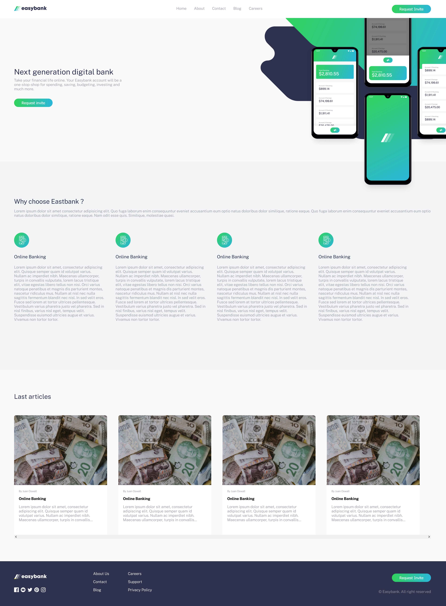

# Frontend Mentor - Easybank landing page solution

This is a solution to the [Easybank landing page challenge on Frontend Mentor](https://www.frontendmentor.io/challenges/easybank-landing-page-WaUhkoDN). Frontend Mentor challenges help you improve your coding skills by building realistic projects. 

## Table of contents

- [Frontend Mentor - Easybank landing page solution](#frontend-mentor---easybank-landing-page-solution)
  - [Table of contents](#table-of-contents)
  - [Overview](#overview)
    - [The challenge](#the-challenge)
    - [Screenshot](#screenshot)
    - [Links](#links)
  - [My process](#my-process)
    - [Built with](#built-with)
  - [Author](#author)

## Overview

### The challenge

Users should be able to:

- View the optimal layout for the site depending on their device's screen size
- See hover states for all interactive elements on the page

### Screenshot

### Links

- Live Site URL: [https://mia-moran.github.io/landing-page/](https://mariamoraan.github.io/landing-page/)

## My process

### Built with

- Semantic HTML5 markup
- CSS
- [React](https://reactjs.org/) - JS library

## Author

- Website - [María Morán](https://www.mariamoran.es)
- Frontend Mentor - [@mia-moran](https://www.frontendmentor.io/profile/yourusername)
- Twitter - [@_mariamoraan](https://www.twitter.com/yourusername)

